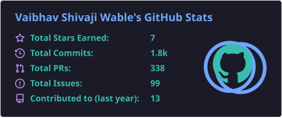
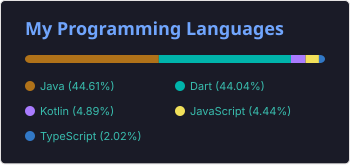
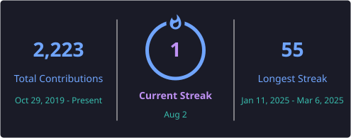

# Hi, I'm Vaibhav Wable 👋

**Software Engineer @ CentraLogic** · Pune, India  
Flutter · React Native · Next.js · Node.js · AI-assisted development

### 💼 Open to Freelancing

Available for freelance and contract work — Flutter / React Native apps, web apps, API integrations, and end-to-end delivery (Play Store & App Store).

**[📧 Let's talk →](mailto:vaibhavswable@gmail.com)** · **[Connect on LinkedIn](https://www.linkedin.com/in/vaibhavwable/)**

---

## About Me

I'm a Software Engineer with **3+ years** of professional experience building cross-platform mobile and web products. I currently work at **CentraLogic**, where I lead Flutter development, ship production apps to Android & iOS, and integrate backend services with Node.js, AWS, and Firebase.

Previously I freelanced as a Mobile Application Developer (2021–2023), delivering client apps end-to-end — UI, APIs, deployment, and post-release support. I also use AI tools like **Cursor** and **Claude** to move faster on features, migrations, and code quality.

- 📱 Cross-platform apps with **Flutter** & **React Native**
- 🏗️ Clean Architecture, BLoC / state management, reusable UI systems
- ☁️ Firebase, Node.js, AWS, CI/CD for mobile releases
- 🤝 Open to freelance projects and interesting collaborations

---

## Experience Highlights

| Role | Company | Focus |
|------|---------|--------|
| **Software Engineer** | [CentraLogic](https://www.linkedin.com/company/centralogic) · Jun 2024 – Present | Flutter & React Native production apps, Play Store / App Store releases, Node.js & AWS backends, Firebase, team leadership |
| **Software Engineer Trainee** | CentraLogic · Jan 2024 – Jun 2024 | Flutter apps, API integration, Firebase, QA & bug fixing |
| **Mobile Application Developer** | Freelance · Aug 2021 – Dec 2023 | End-to-end client apps: requirements → UI → APIs → deployment → support |
| **Android Developer** | RootKit Consultancy Services · 2023 | Kotlin / XML apps, performance & stability |

**Education:** Master's in Computer Science (Indira College, Pune) · Bachelor's in Computer Science (Modern College, Pune — First Class with Distinction)

---

## Tech Stack

  

**Also working with:** Expo · Codemagic · Cursor · Claude · GitHub Copilot · Postman · Android Studio · Xcode

---

## Featured Projects

| Project | Description | Stack |
|---------|-------------|--------|
| [**Portfolio**](https://wablevaibhav.github.io/) | Personal portfolio site | React, Vite, Tailwind |
| [**LinkedIn Clone**](https://github.com/wablevaibhav/LinkedIn) | LinkedIn-inspired Android app | Kotlin |
| [**FoodRunner**](https://github.com/wablevaibhav/FoodRunner) | Food ordering practice app | Kotlin |
| [**Resume Builder**](https://github.com/wablevaibhav/resume_builder) | Resume builder web app | Django, Python |
| [**FolkChat**](https://github.com/wablevaibhav/FolkChat) | Messaging app | Java |
| [**claryft_components**](https://github.com/wablevaibhav/claryft_components) | Custom Flutter UI components | Dart, Flutter |

More on GitHub → [github.com/wablevaibhav](https://github.com/wablevaibhav) · **41 public repos** · **15 gists**

---

## GitHub Stats

<!-- Cards auto-refresh every 6h via GitHub Actions (includes private repos when GRS_PAT secret is set). -->

  
  

  

  

  

---

## What I Can Help With (Freelance)

- Cross-platform **Flutter** / **React Native** apps (Android + iOS)
- Feature work, bug fixes, performance tuning, and store releases
- **Firebase** / REST API integration and Node.js backends
- UI component libraries and Clean Architecture setups
- Short-term contracts or ongoing product collaboration

---

### Let's build something great

⭐ From [wablevaibhav](https://github.com/wablevaibhav)

